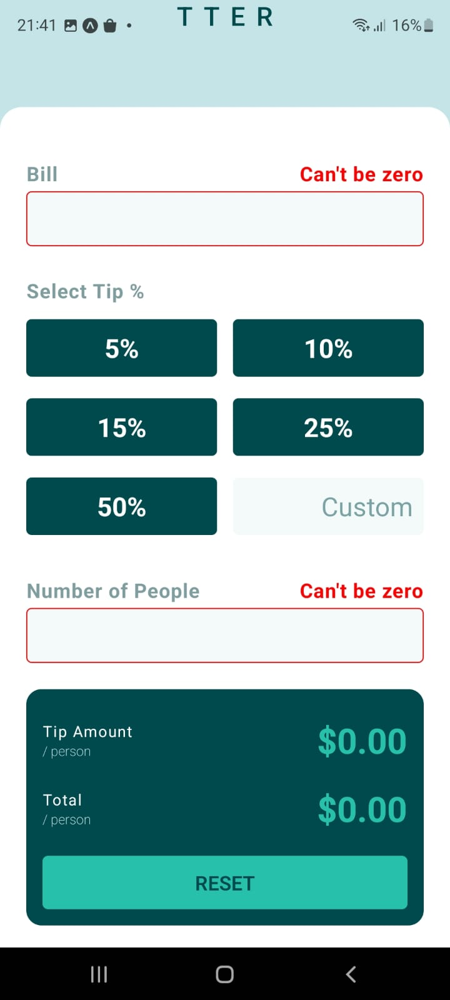
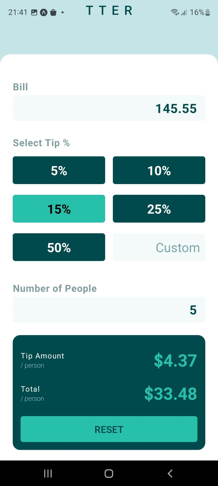

# Frontend Mentor - Tip calculator app solution

This is a solution to the [Tip calculator app challenge on Frontend Mentor](https://www.frontendmentor.io/challenges/tip-calculator-app-ugJNGbJUX). The challenge was supposed to be for web scenario. But I have choose to use this challenge with React-Native for study scenarios.

## Table of contents

- [Overview](#overview)
  - [The challenge](#the-challenge)
  - [Screenshot](#screenshot)
- [Built with](#built-with)
- [Author](#author)

**Note: Delete this note and update the table of contents based on what sections you keep.**

## Overview

This project is a basic tip calculator with pre-setup percentage and total number of people that gonna pay the bill.

### The challenge

Users should be able to:

- See states for all interactive elements on the page
- Calculate the correct tip and total cost of the bill per person

### Screenshot

Unfilled             |  Filled
:-------------------------:|:-------------------------:
  |  

## Built with

- [React Native](https://reactjs.org/) - JS library
- [Typescript](https://styled-components.com/) - For typescript

## Author

- Website - [Dheyson Alves](https://dheysonalvesportfolio.netlify.app/)
- Twitter - [@dheysonlalves](https://twitter.com/dheysonlalves)
